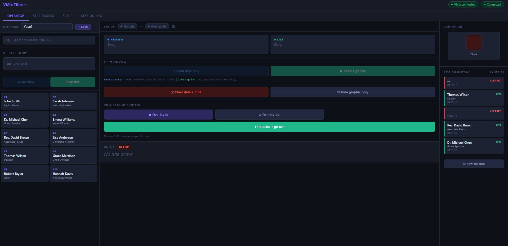
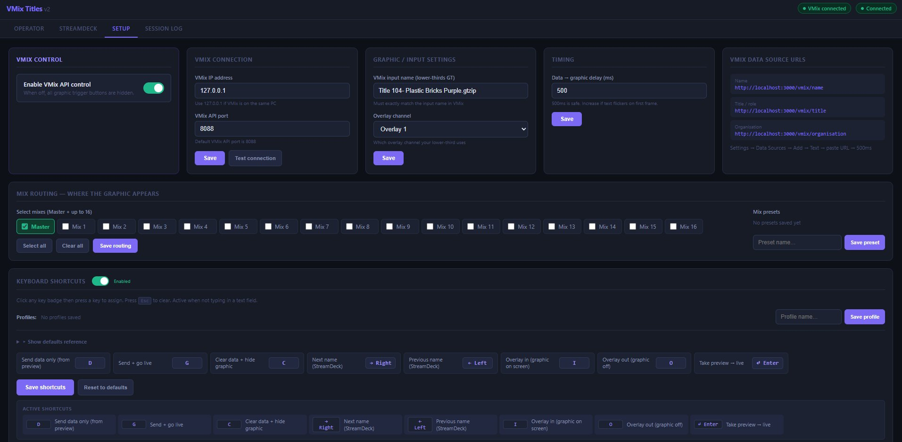
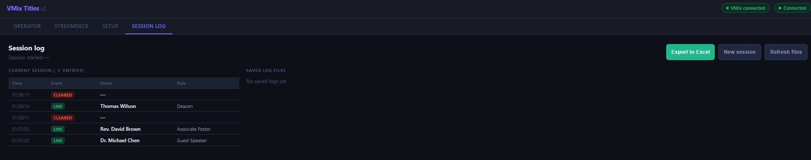

# VMix Title Controller

A low-latency lower-thirds title controller for VMix, built as a local Node.js server. Replaces Google Sheets / Cloud API (~5 second latency) with a local web server (~1–5ms latency).

Built for live production environments — church services, conferences, events, broadcasts.

---

## Screenshots

### Operator View


The main operator interface. Search names, type an ID, click a card to cue into preview, then send data only or take live with VMix control.

### Setup Page


Configure VMix connection, overlay channel, timing, mix routing across all 16 mixes, and fully reassignable keyboard shortcuts with named profiles.

### Session Log


Full session history with timestamps, event types (LIVE / CLEARED), and one-click Excel export.

---

## Features

- **Near-zero latency** — local server responds in 1–5ms vs 5+ seconds via Google Sheets
- **Two operating modes** — Remote Operator (web UI) or StreamDeck (HTTP endpoints)
- **Preview / Live workflow** — cue a speaker to preview, then send data only or take live automatically
- **VMix API integration** — trigger overlay in/out directly from the web interface
- **Real-time overlay status** — polls VMix every 2 seconds to show whether the graphic is actually on screen
- **Multi-mix routing** — send the overlay to any combination of Master + up to 16 mixes
- **Mix presets** — save named mix configurations for quick recall per venue
- **Keyboard shortcuts** — fully reassignable, with named profiles (e.g. Remote Op, StreamDeck Op)
- **Shortcuts enable/disable toggle** — turn off shortcuts without losing configuration
- **Session logging** — full log of every take/clear with operator name and timestamp
- **Excel export** — exports session log as a formatted `.xlsx` file per session
- **Scene presets** — save complete configuration (VMix settings + routing + shortcuts) as named scenes
- **Config export/import** — back up or transfer all settings as a `.json` file
- **Reset to defaults** — one-click factory reset
- **Operator names** — saved to server, persist across sessions and appear in logs
- **Companion / StreamDeck feedback** — WebSocket events for button flash integration
- **Mobile responsive** — full UI works on phones and tablets for remote operators
- **Live names database** — edit `data/names.csv` and the server reloads automatically

---

## Requirements

- **Node.js** v18 or higher — download from [nodejs.org](https://nodejs.org) (LTS version)
- VMix (any version with Data Sources and API support)
- All devices on the same local network

---

## Installation

1. Download or clone this repository
2. Open a terminal / command prompt in the project folder
3. Run:

```bash
npm install
node server.js
```

Or on Windows, double-click **START.bat**

4. Open **http://localhost:3000** in your browser

The server prints your network IP on startup — remote operators use that address.

---

## VMix Setup

### Data Sources (for text polling)

In VMix: **Settings → Data Sources → Add New → Text**

Add three data sources:

| Field | URL |
|-------|-----|
| Name | `http://localhost:3000/vmix/name` |
| Title / Role | `http://localhost:3000/vmix/title` |
| Organisation | `http://localhost:3000/vmix/organisation` |

Set **polling interval to 500ms** on each.

Map each data source to the corresponding text field in your lower-thirds title template.

### API (for overlay control)

In VMix: **Settings → Web Controller** — ensure the API is enabled on port **8088** (default).

In the VMix Title Controller Setup page, set:
- **VMix IP** → `127.0.0.1` (if VMix is on the same PC) or the VMix machine's IP
- **VMix input name** → the exact name of your lower-thirds GT input in VMix
- **Overlay channel** → whichever overlay channel your lower-third uses

---

## Names Database

Edit `data/names.csv`:

```csv
id,name,title,organisation
1,John Smith,Senior Pastor,First Baptist Church
2,Sarah Johnson,Worship Leader,First Baptist Church
3,Dr. Michael Chen,Guest Speaker,City College
```

The server watches this file and reloads automatically when saved — no restart needed.

---

## Operating Modes

### Mode A — Remote Operator

A remote operator opens `http://YOUR-PC-IP:3000` on any device on the network.

**Workflow:**
1. Type an ID number or click a name card → sends to **Preview** slot
2. Press **Send data only** → loads text into the graphic, VMix operator controls when it goes live
3. Press **Send + go live** → loads text AND triggers the VMix overlay automatically after the configured delay
4. Press **Clear data + hide** → clears text and hides the overlay

### Mode B — StreamDeck

Configure StreamDeck buttons to POST to these endpoints:

| Action | Method | URL |
|--------|--------|-----|
| Next title | POST | `http://localhost:3000/next` |
| Previous title | POST | `http://localhost:3000/prev` |
| Clear / blank | POST | `http://localhost:3000/clear` |
| Set specific ID | POST | `http://localhost:3000/set/5` |

Use the **HTTP Request** plugin in StreamDeck software.

---

## Status Indicator

The status bar at the top of the operator view shows two chips:

| State | Meaning |
|-------|---------|
| Grey "No data" | Nothing loaded, overlay off |
| Amber "Data loaded" | Text sent to graphic, overlay not triggered |
| Teal "~ On screen in VMix" | Overlay is live (polls VMix every 2s) |

> The overlay status is approximate — it polls VMix every 2 seconds. Manual changes in VMix may take up to 2 seconds to reflect.

---

## Keyboard Shortcuts

Default assignments (all reassignable in Setup):

| Key | Action |
|-----|--------|
| `D` | Send data only (from preview) |
| `G` | Send + go live |
| `C` | Clear data + hide graphic |
| `→` | Next name (StreamDeck mode) |
| `←` | Previous name (StreamDeck mode) |
| `I` | Overlay in |
| `O` | Overlay out |
| `Enter` | Take preview live |

Shortcuts are active when you are not typing in a text input. They can be disabled entirely via the toggle in Setup.

---

## Companion / Bitfocus Integration

Connect Companion to the WebSocket at `ws://localhost:3000`.

Events sent:

```json
{ "type": "title_changed", "isBlank": false, "live": { "name": "John Smith", "title": "Senior Pastor" }, "updatedBy": "Yusuf" }
{ "type": "overlay_state", "overlayLive": true }
{ "type": "preview_changed", "preview": { ... } }
```

Recommended setup:
- On `title_changed` where `isBlank = false` → flash button green
- On `title_changed` where `isBlank = true` → flash button red
- On `overlay_state` where `overlayLive = true` → button solid green

---

## API Reference

| Method | Endpoint | Description |
|--------|----------|-------------|
| GET | `/vmix/name` | Current name (plain text for VMix) |
| GET | `/vmix/title` | Current title/role (plain text) |
| GET | `/vmix/organisation` | Current organisation (plain text) |
| POST | `/set/:id` | Set live data by ID (no VMix trigger) |
| POST | `/take/:id` | Set data + trigger VMix overlay |
| POST | `/preview/:id` | Send to preview slot |
| POST | `/take-preview` | Take preview to live + trigger overlay |
| POST | `/clear` | Clear data + hide overlay |
| POST | `/vmix/in` | Trigger overlay in |
| POST | `/vmix/out` | Trigger overlay out |
| POST | `/next` | Next in list + take live |
| POST | `/prev` | Previous in list + take live |
| GET | `/db` | Full names database (JSON) |
| GET | `/status` | Server health + current state |
| GET | `/config` | Current configuration |
| POST | `/config` | Save configuration |
| POST | `/export` | Export session log to Excel |
| GET | `/logs` | List saved log files |
| GET | `/logs/:filename` | Download a log file |
| POST | `/new-session` | Reset session log and history |
| GET | `/operators` | List saved operator names |
| POST | `/operators` | Save an operator name |

---

## Project Structure

```
vmix-titles/
├── server.js           # Express + WebSocket server
├── package.json
├── config.json         # Saved configuration (auto-created)
├── START.bat           # Windows launcher
├── data/
│   ├── names.csv       # Names database — edit this
│   └── operators.json  # Saved operator names (auto-created)
├── logs/               # Exported Excel session logs
├── public/
│   └── index.html      # Full web UI
└── docs/
    ├── screenshot-operator.png
    ├── screenshot-setup.png
    └── screenshot-log.png
```

---

## Latency Comparison

| Method | Typical latency |
|--------|----------------|
| Google Sheets + Cloud API | 3–8 seconds |
| This server (local network) | 1–10ms |

---

## License

MIT — free to use, modify, and distribute.
